# Premium Gym Management System - System Architecture

## Executive Summary

A comprehensive, multi-tenant SaaS platform for gym management featuring mobile applications for members and trainers, a powerful admin dashboard, AI-powered fitness coaching, and complete business operations automation.

---

## System Overview

```mermaid
flowchart TB
    subgraph ClientLayer["Client Layer"]
        MA[("📱 Member App<br/>(FlutterFlow)")]
        TA[("📱 Trainer App<br/>(FlutterFlow)")]
        AD[("💻 Admin Dashboard<br/>(React + TypeScript)")]
        SA[("💻 Super Admin<br/>(React + TypeScript)")]
    end
    
    subgraph FirebaseServices["Firebase Platform"]
        AUTH["🔐 Firebase Auth<br/>(Phone OTP + Google)"]
        FS["📊 Cloud Firestore<br/>(NoSQL Database)"]
        ST["📁 Cloud Storage<br/>(Media Files)"]
        CF["⚡ Cloud Functions<br/>(Backend Logic)"]
        FCM["🔔 FCM<br/>(Push Notifications)"]
        FH["🌐 Firebase Hosting<br/>(Dashboard)"]
    end
    
    subgraph ExternalServices["External Services"]
        RP["💳 Razorpay<br/>(Payments)"]
        AI["🤖 AI Service<br/>(GPT-4o-mini/Gemini)"]
        EM["📧 Email Service<br/>(SendGrid/Firebase)"]
    end
    
    MA --> AUTH
    TA --> AUTH
    AD --> AUTH
    SA --> AUTH
    
    MA --> FS
    TA --> FS
    AD --> FS
    SA --> FS
    
    MA --> ST
    TA --> ST
    
    CF --> FS
    CF --> FCM
    CF --> RP
    CF --> AI
    CF --> EM
    
    AD --> FH
    SA --> FH
```

---

## Architecture Principles

### 1. Multi-Tenancy Architecture
- **Gym Isolation**: Each gym operates as an isolated tenant
- **Branch Support**: Gyms can have multiple branches
- **Data Segregation**: Strict data boundaries between tenants
- **Shared Infrastructure**: Common codebase, separated data

### 2. Serverless-First Design
- No server management overhead
- Auto-scaling based on demand
- Pay-per-use cost model
- High availability by default

### 3. Real-Time Synchronization
- Firestore real-time listeners
- Instant data updates across devices
- Offline-first mobile experience

### 4. Security by Design
- Role-based access control (RBAC)
- Firebase Security Rules
- API key protection
- Webhook signature verification

---

## Component Architecture

### Mobile Application (FlutterFlow)

**Key Features:**
- Single codebase for Member + Trainer roles
- Role-based UI rendering
- Offline data caching
- QR code generation & scanning
- Real-time chat with AI

### Admin Dashboard (React + TypeScript)

**Technology Stack:**
- React 18 with TypeScript
- Vite for build tooling
- React Router for navigation
- TanStack Query for data fetching
- Zustand/Context for state
- Recharts for analytics
- Material UI or Custom components

### Backend (Cloud Functions)

---

## Data Flow Architecture

### Member Check-In Flow

### Payment Flow

### AI Trainer Interaction Flow

---

## Deployment Architecture

**Environment Strategy:**
- **Development**: Firebase Emulator Suite for local testing
- **Staging**: Separate Firebase project for QA
- **Production**: Live environment with monitoring

---

## Scalability Considerations

### Firestore Scaling
| Aspect | Strategy |
|--------|----------|
| Read Heavy | Use composite indexes, denormalization |
| Write Heavy | Distributed counters, batch writes |
| Large Collections | Pagination with cursors |
| Real-time | Limit listener scope |

### Cloud Functions Scaling
| Aspect | Strategy |
|--------|----------|
| Cold Starts | Min instances for critical functions |
| Memory | Right-size based on workload |
| Timeout | Appropriate limits per function type |
| Concurrency | Configure based on downstream limits |

### Storage Scaling
| Aspect | Strategy |
|--------|----------|
| Image Uploads | Client-side compression |
| Video | External CDN integration |
| Backups | Automated daily exports |

---

## Monitoring & Observability

---

## Cost Optimization

### Firebase Pricing Tiers
- **Spark Plan**: Development/Testing (Free)
- **Blaze Plan**: Production (Pay-as-you-go)

### Cost Control Measures
1. **Firestore**: Optimize queries, use caching
2. **Functions**: Minimize invocations, optimize memory
3. **Storage**: Compress images, set lifecycle rules
4. **Bandwidth**: Use CDN, minimize payload sizes

---

## Security Architecture

**Key Security Features:**
- Multi-factor authentication support
- Role-based security rules
- API key rotation
- Webhook signature verification
- Data encryption at rest and transit
- GDPR compliance ready

---

## Next Steps

1. → [Database Schema](./02-database-schema.md)
2. → [Design System](./03-design-system.md)
3. → [Mobile App Screens](./04-mobile-app-screens.md)
4. → [Cloud Functions](./05-cloud-functions.md)
5. → [API Contracts](./06-api-contracts.md)
