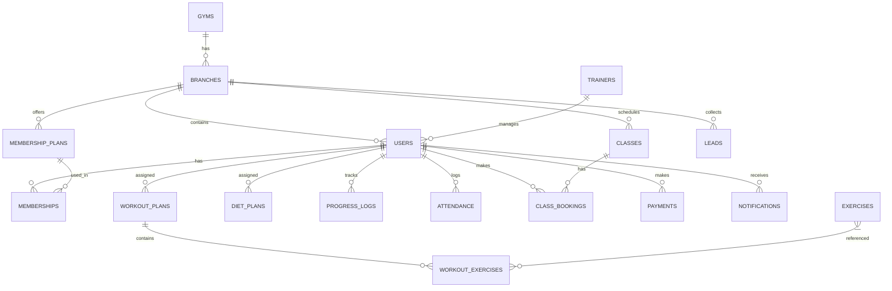

# Firestore Database Schema

## Overview

This document defines the complete Firestore database structure for the Premium Gym Management System. The schema is designed for multi-tenancy, scalability, and real-time synchronization.

---

## Entity Relationship Diagram



---

## Collections Reference

### Quick Reference Table

| Collection | Parent | Purpose | Key Indexes |
|------------|--------|---------|-------------|
| `gyms` | Root | Gym organizations | `status`, `createdAt` |
| `branches` | Root | Gym locations | `gymId`, `status` |
| `users` | Root | All user accounts | `branchId`, `role`, `phone` |
| `memberships` | Root | Member subscriptions | `userId`, `endDate`, `status` |
| `membershipPlans` | Root | Subscription plans | `branchId`, `status` |
| `workoutPlans` | Root | Workout assignments | `userId`, `status` |
| `exercises` | Root | Exercise library | `muscleGroup`, `difficulty` |
| `dietPlans` | Root | Diet assignments | `userId`, `status` |
| `progressLogs` | Root | Member measurements | `userId`, `date` |
| `attendance` | Root | Check-in records | `userId`, `branchId`, `date` |
| `classes` | Root | Group classes | `branchId`, `dateTime`, `status` |
| `classBookings` | Root | Class reservations | `classId`, `userId`, `status` |
| `payments` | Root | Payment records | `userId`, `createdAt`, `status` |
| `leads` | Root | Sales leads | `branchId`, `status`, `createdAt` |
| `notifications` | Root | Push notifications | `userId`, `read`, `createdAt` |
| `aiConversations` | Root | AI chat history | `userId`, `createdAt` |
| `templates` | Root | Workout/Diet templates | `branchId`, `type` |

---

## Detailed Schema Definitions

### 1. Gyms Collection

**Path:** `/gyms/{gymId}`

```typescript
interface Gym {
  id: string;                    // Auto-generated
  name: string;                  // "FitZone Gyms"
  slug: string;                  // "fitzone-gyms" (unique)
  logo: string;                  // Storage URL
  coverImage?: string;           // Storage URL
  ownerUserId: string;           // Reference to owner user
  contactEmail: string;          // "admin@fitzone.com"
  contactPhone: string;          // "+919876543210"
  website?: string;              // "https://fitzone.com"
  address: {
    line1: string;
    line2?: string;
    city: string;
    state: string;
    country: string;
    postalCode: string;
  };
  subscription: {
    plan: 'free' | 'basic' | 'pro' | 'enterprise';
    status: 'active' | 'suspended' | 'cancelled';
    startDate: Timestamp;
    endDate: Timestamp;
    maxBranches: number;         // Based on plan
    maxMembers: number;          // Based on plan
  };
  settings: {
    currency: string;            // "INR"
    timezone: string;            // "Asia/Kolkata"
    defaultLanguage: string;     // "en"
    features: {
      aiTrainer: boolean;
      qrCheckIn: boolean;
      onlinePayments: boolean;
      classBooking: boolean;
      progressTracking: boolean;
    };
  };
  branding: {
    primaryColor: string;        // "#D4AF37"
    secondaryColor: string;      // "#C8A23F"
    logoLight?: string;
    logoDark?: string;
  };
  status: 'active' | 'inactive' | 'suspended';
  createdAt: Timestamp;
  updatedAt: Timestamp;
}
```

**Indexes:**
- `status` + `createdAt` (for listing active gyms)
- `slug` (unique, for URL routing)
- `ownerUserId` (for owner queries)

---

### 2. Branches Collection

**Path:** `/branches/{branchId}`

```typescript
interface Branch {
  id: string;                    // Auto-generated
  gymId: string;                 // Reference to parent gym
  name: string;                  // "FitZone - Koramangala"
  code: string;                  // "FZ-KOR" (unique per gym)
  address: {
    line1: string;
    line2?: string;
    city: string;
    state: string;
    country: string;
    postalCode: string;
    coordinates?: {
      latitude: number;
      longitude: number;
    };
  };
  contactPhone: string;
  contactEmail: string;
  operatingHours: {
    [day: string]: {             // "monday", "tuesday", etc.
      isOpen: boolean;
      openTime: string;          // "06:00"
      closeTime: string;         // "22:00"
    };
  };
  amenities: string[];           // ["parking", "shower", "locker", "wifi"]
  images: string[];              // Storage URLs
  capacity: number;              // Max simultaneous members
  managerId?: string;            // Reference to manager user
  razorpayAccountId?: string;    // For split payments
  status: 'active' | 'inactive' | 'maintenance';
  createdAt: Timestamp;
  updatedAt: Timestamp;
}
```

**Indexes:**
- `gymId` + `status` (list branches per gym)
- `gymId` + `code` (unique branch code per gym)
- `city` + `status` (location-based queries)

---

### 3. Users Collection

**Path:** `/users/{userId}`

```typescript
interface User {
  id: string;                    // Firebase Auth UID
  gymId: string;                 // Primary gym association
  branchId: string;              // Primary branch
  role: 'member' | 'trainer' | 'admin' | 'superadmin';
  
  // Profile Information
  profile: {
    firstName: string;
    lastName: string;
    displayName: string;         // Computed
    email?: string;
    phone: string;               // Primary identifier
    photoUrl?: string;           // Storage URL
    gender: 'male' | 'female' | 'other' | 'prefer_not_to_say';
    dateOfBirth: Timestamp;
    bio?: string;
  };
  
  // Physical Details (for members)
  physicalDetails?: {
    height: number;              // cm
    initialWeight: number;       // kg
    currentWeight: number;       // kg
    bloodGroup?: string;
    medicalConditions?: string[];
    allergies?: string[];
  };
  
  // Fitness Goals (for members)
  goals?: {
    primary: 'weight_loss' | 'muscle_gain' | 'maintenance' | 'strength' | 'endurance' | 'flexibility';
    targetWeight?: number;       // kg
    experienceLevel: 'beginner' | 'intermediate' | 'advanced';
    preferredWorkoutDays: number; // 3-6
    notes?: string;
  };
  
  // Trainer-specific fields
  trainerDetails?: {
    specializations: string[];   // ["weight training", "yoga", "cardio"]
    certifications: string[];
    experience: number;          // Years
    maxClients: number;
    currentClients: number;
    rating: number;              // 1-5
    reviewCount: number;
  };
  
  // Assigned trainer (for members)
  assignedTrainerId?: string;
  
  // FCM tokens for push notifications
  fcmTokens: {
    [deviceId: string]: {
      token: string;
      platform: 'ios' | 'android' | 'web';
      updatedAt: Timestamp;
    };
  };
  
  // Preferences
  preferences: {
    language: string;            // "en"
    notifications: {
      push: boolean;
      email: boolean;
      sms: boolean;
      workoutReminders: boolean;
      classReminders: boolean;
      membershipAlerts: boolean;
      promotions: boolean;
    };
    privacy: {
      showProgress: boolean;     // To trainer
      showInLeaderboard: boolean;
    };
  };
  
  // Statistics (denormalized for quick access)
  stats?: {
    totalWorkouts: number;
    totalClasses: number;
    currentStreak: number;
    longestStreak: number;
    lastCheckIn?: Timestamp;
  };
  
  status: 'active' | 'inactive' | 'suspended';
  onboardingCompleted: boolean;
  createdAt: Timestamp;
  updatedAt: Timestamp;
  lastActiveAt: Timestamp;
}
```

**Indexes:**
- `branchId` + `role` + `status` (list members/trainers per branch)
- `gymId` + `role` + `status` (list all users per gym)
- `phone` (unique, for login)
- `email` (for email-based queries)
- `assignedTrainerId` + `status` (trainer's client list)
- `role` + `createdAt` (admin listings)

---

### 4. Memberships Collection

**Path:** `/memberships/{membershipId}`

```typescript
interface Membership {
  id: string;
  userId: string;
  branchId: string;
  gymId: string;
  planId: string;                // Reference to membershipPlans
  
  // Plan snapshot at time of purchase
  planSnapshot: {
    name: string;
    durationDays: number;
    price: number;
    currency: string;
    features: string[];
  };
  
  // Dates
  startDate: Timestamp;
  endDate: Timestamp;
  pausedAt?: Timestamp;          // If membership is paused
  pausedUntil?: Timestamp;
  
  // Billing
  price: number;
  currency: string;
  discount?: {
    type: 'percentage' | 'fixed';
    value: number;
    code?: string;
  };
  finalPrice: number;
  
  // Payment reference
  paymentId?: string;            // Reference to payments collection
  
  // Renewal settings
  autoRenew: boolean;
  renewalRemindersSent: number[];  // Days before expiry [7, 3, 1]
  
  // Status
  status: 'pending' | 'active' | 'expired' | 'cancelled' | 'paused';
  cancellationReason?: string;
  
  createdAt: Timestamp;
  updatedAt: Timestamp;
  createdBy: string;             // Admin who created or 'self'
}
```

**Indexes:**
- `userId` + `status` (get active membership)
- `branchId` + `endDate` (expiring soon queries)
- `gymId` + `status` + `createdAt` (admin reports)
- `endDate` + `status` (cron job for expiry notifications)

---

### 5. Membership Plans Collection

**Path:** `/membershipPlans/{planId}`

```typescript
interface MembershipPlan {
  id: string;
  gymId: string;
  branchId?: string;             // null = all branches
  
  name: string;                  // "Gold Annual"
  description: string;
  durationDays: number;          // 365
  price: number;                 // 25000
  currency: string;              // "INR"
  
  features: string[];            // ["Unlimited gym access", "Personal trainer", ...]
  
  // Limits
  limits?: {
    classesPerMonth?: number;    // null = unlimited
    guestPasses?: number;
    freezeDays?: number;
  };
  
  // Display
  displayOrder: number;
  isPopular: boolean;            // Show badge
  badge?: string;                // "Best Value"
  color?: string;                // For UI cards
  
  // Availability
  isActive: boolean;
  validFrom?: Timestamp;
  validUntil?: Timestamp;
  
  createdAt: Timestamp;
  updatedAt: Timestamp;
}
```

**Indexes:**
- `branchId` + `isActive` + `displayOrder` (list plans for branch)
- `gymId` + `isActive` (all plans for gym)

---

### 6. Workout Plans Collection

**Path:** `/workoutPlans/{workoutPlanId}`

```typescript
interface WorkoutPlan {
  id: string;
  userId: string;
  gymId: string;
  branchId: string;
  
  name: string;                  // "4-Day Push-Pull-Legs"
  description?: string;
  type: 'custom' | 'template';
  templateId?: string;           // If based on template
  
  // Schedule configuration
  daysPerWeek: number;           // 3-6
  schedule: WorkoutDay[];
  
  // Metadata
  createdBy: string;             // Trainer userId or 'ai'
  assignedBy?: string;           // Who assigned this plan
  
  // Validity
  startDate: Timestamp;
  endDate?: Timestamp;           // null = indefinite
  
  // Progress tracking
  currentWeek: number;
  totalWeeks?: number;
  
  status: 'active' | 'completed' | 'paused' | 'archived';
  notes?: string;
  
  createdAt: Timestamp;
  updatedAt: Timestamp;
}

interface WorkoutDay {
  dayNumber: number;             // 1-7
  dayName: string;               // "Push Day"
  muscleGroups: string[];        // ["chest", "shoulders", "triceps"]
  isRestDay: boolean;
  exercises: WorkoutExercise[];
}

interface WorkoutExercise {
  exerciseId: string;            // Reference to exercises collection
  order: number;
  
  // Snapshot for offline access
  exerciseSnapshot: {
    name: string;
    muscleGroup: string;
    thumbnailUrl?: string;
  };
  
  sets: ExerciseSet[];
  restBetweenSets: number;       // Seconds
  notes?: string;
  supersetWith?: string;         // exerciseId for superset
}

interface ExerciseSet {
  setNumber: number;
  type: 'warmup' | 'working' | 'dropset' | 'failure';
  targetReps: number | string;   // 12 or "8-12" or "failure"
  targetWeight?: number;         // kg
  targetDuration?: number;       // Seconds (for planks, etc.)
  restAfter?: number;            // Seconds (override)
}
```

**Indexes:**
- `userId` + `status` (active plan for user)
- `createdBy` + `createdAt` (trainer's created plans)
- `gymId` + `type` (template listings)

---

### 7. Exercises Collection

**Path:** `/exercises/{exerciseId}`

```typescript
interface Exercise {
  id: string;
  gymId?: string;                // null = global exercise
  
  name: string;                  // "Barbell Bench Press"
  aliases?: string[];            // ["Flat Bench Press", "BB Bench"]
  description: string;
  
  // Categorization
  muscleGroup: string;           // "chest"
  secondaryMuscles?: string[];   // ["shoulders", "triceps"]
  equipment: string[];           // ["barbell", "bench"]
  category: 'strength' | 'cardio' | 'flexibility' | 'plyometric' | 'compound';
  movement: string;              // "push" | "pull" | "legs" | "core"
  
  // Difficulty
  difficulty: 'beginner' | 'intermediate' | 'advanced';
  
  // Instructions
  instructions: string[];        // Step-by-step
  tips?: string[];               // Pro tips
  commonMistakes?: string[];     // What to avoid
  
  // Media
  thumbnailUrl?: string;
  videoUrl?: string;             // Demo video
  animationUrl?: string;         // GIF animation
  images?: string[];
  
  // Metadata
  isCustom: boolean;             // Gym-specific exercise
  isActive: boolean;
  
  createdAt: Timestamp;
  updatedAt: Timestamp;
}
```

**Indexes:**
- `muscleGroup` + `difficulty` (filter exercises)
- `category` + `isActive` (list by type)
- `gymId` + `isActive` (gym's custom exercises)
- Full-text search on `name`, `aliases`

---

### 8. Diet Plans Collection

**Path:** `/dietPlans/{dietPlanId}`

```typescript
interface DietPlan {
  id: string;
  userId: string;
  gymId: string;
  branchId: string;
  
  name: string;                  // "High Protein Muscle Building"
  description?: string;
  type: 'custom' | 'template';
  templateId?: string;
  
  // Nutritional targets
  dailyTargets: {
    calories: number;
    protein: number;             // grams
    carbs: number;               // grams
    fats: number;                // grams
    fiber?: number;              // grams
    water?: number;              // liters
  };
  
  // Meal plan
  meals: Meal[];
  
  // Preferences
  dietaryPreferences: string[];  // ["vegetarian", "no-dairy"]
  allergies: string[];
  
  // Metadata
  createdBy: string;             // Trainer userId or 'ai'
  assignedBy?: string;
  
  // Validity
  startDate: Timestamp;
  endDate?: Timestamp;
  
  status: 'active' | 'completed' | 'paused' | 'archived';
  notes?: string;
  
  createdAt: Timestamp;
  updatedAt: Timestamp;
}

interface Meal {
  id: string;
  name: string;                  // "Breakfast"
  time: string;                  // "08:00"
  items: MealItem[];
  notes?: string;
}

interface MealItem {
  name: string;                  // "Oatmeal with Berries"
  quantity: string;              // "1 cup" or "200g"
  calories: number;
  protein: number;
  carbs: number;
  fats: number;
  alternatives?: string[];       // Swap options
  recipe?: string;               // Preparation instructions
  imageUrl?: string;
}
```

**Indexes:**
- `userId` + `status` (active diet for user)
- `createdBy` + `createdAt` (trainer's plans)

---

### 9. Progress Logs Collection

**Path:** `/progressLogs/{logId}`

```typescript
interface ProgressLog {
  id: string;
  userId: string;
  gymId: string;
  branchId: string;
  
  date: Timestamp;               // Date of measurement
  
  // Body measurements (all in cm unless specified)
  measurements: {
    weight: number;              // kg
    bodyFatPercentage?: number;
    neck?: number;
    shoulders?: number;
    chest?: number;
    leftBicep?: number;
    rightBicep?: number;
    leftForearm?: number;
    rightForearm?: number;
    waist?: number;
    hips?: number;
    leftThigh?: number;
    rightThigh?: number;
    leftCalf?: number;
    rightCalf?: number;
  };
  
  // Progress photos
  photos?: {
    front?: string;              // Storage URL
    back?: string;
    leftSide?: string;
    rightSide?: string;
  };
  
  // Optional notes
  notes?: string;
  mood?: 'great' | 'good' | 'okay' | 'tired' | 'exhausted';
  sleepHours?: number;
  waterIntake?: number;          // liters
  
  // Who recorded this
  recordedBy: string;            // userId (self or trainer)
  
  createdAt: Timestamp;
}
```

**Indexes:**
- `userId` + `date` DESC (user's progress history)
- `userId` + `createdAt` DESC (recent logs)
- `recordedBy` + `createdAt` (trainer activity)

---

### 10. Attendance Collection

**Path:** `/attendance/{attendanceId}`

```typescript
interface Attendance {
  id: string;
  userId: string;
  gymId: string;
  branchId: string;
  
  date: string;                  // "2024-01-15" (for daily uniqueness)
  
  checkInTime: Timestamp;
  checkOutTime?: Timestamp;
  
  // Check-in method
  method: 'qr_code' | 'manual' | 'biometric' | 'auto';
  
  // Duration
  durationMinutes?: number;      // Calculated on checkout
  
  // Verification
  verifiedBy?: string;           // Staff userId (for manual)
  qrDeviceId?: string;           // Scanner device
  
  // Location (optional)
  location?: {
    latitude: number;
    longitude: number;
  };
  
  // Notes
  notes?: string;
  
  createdAt: Timestamp;
  updatedAt: Timestamp;
}
```

**Indexes:**
- `userId` + `date` DESC (user attendance history)
- `branchId` + `date` (daily attendance report)
- `gymId` + `checkInTime` (real-time dashboard)
- `userId` + `branchId` + `date` (unique constraint simulation)

---

### 11. Classes Collection

**Path:** `/classes/{classId}`

```typescript
interface Class {
  id: string;
  gymId: string;
  branchId: string;
  
  name: string;                  // "Power Yoga"
  description: string;
  category: string;              // "yoga", "hiit", "spinning", etc.
  
  // Schedule
  dateTime: Timestamp;           // Start time
  durationMinutes: number;       // 60
  
  // Recurring settings
  isRecurring: boolean;
  recurringPattern?: {
    frequency: 'daily' | 'weekly' | 'monthly';
    daysOfWeek?: number[];       // [1, 3, 5] for Mon, Wed, Fri
    endDate?: Timestamp;
  };
  parentClassId?: string;        // For recurring instances
  
  // Trainer
  trainerId: string;
  trainerSnapshot: {
    name: string;
    photoUrl?: string;
  };
  
  // Capacity
  capacity: number;              // Max 20
  bookedCount: number;           // Current bookings
  waitlistEnabled: boolean;
  waitlistCount: number;
  
  // Location
  room?: string;                 // "Studio A"
  
  // Requirements
  difficulty: 'beginner' | 'intermediate' | 'advanced' | 'all_levels';
  requirements?: string[];       // ["yoga mat", "water bottle"]
  
  // Status
  status: 'scheduled' | 'ongoing' | 'completed' | 'cancelled';
  cancellationReason?: string;
  
  // Media
  thumbnailUrl?: string;
  
  createdAt: Timestamp;
  updatedAt: Timestamp;
}
```

**Indexes:**
- `branchId` + `dateTime` (list upcoming classes)
- `trainerId` + `dateTime` (trainer schedule)
- `branchId` + `status` + `dateTime` (active classes)
- `category` + `dateTime` (filter by type)

---

### 12. Class Bookings Collection

**Path:** `/classBookings/{bookingId}`

```typescript
interface ClassBooking {
  id: string;
  classId: string;
  userId: string;
  gymId: string;
  branchId: string;
  
  // Class snapshot
  classSnapshot: {
    name: string;
    dateTime: Timestamp;
    trainerId: string;
    trainerName: string;
  };
  
  // Booking details
  bookedAt: Timestamp;
  
  // Status
  status: 'confirmed' | 'waitlisted' | 'cancelled' | 'attended' | 'no_show';
  waitlistPosition?: number;
  
  // Cancellation
  cancelledAt?: Timestamp;
  cancelledBy?: string;          // userId or 'system'
  cancellationReason?: string;
  
  // Attendance marking
  attendedAt?: Timestamp;
  markedBy?: string;             // Trainer or system
  
  // Reminder sent
  reminderSent: boolean;
  
  createdAt: Timestamp;
  updatedAt: Timestamp;
}
```

**Indexes:**
- `classId` + `status` (class attendee list)
- `userId` + `status` (user's bookings)
- `userId` + `classSnapshot.dateTime` DESC (upcoming classes)
- `classId` + `waitlistPosition` (waitlist order)

---

### 13. Payments Collection

**Path:** `/payments/{paymentId}`

```typescript
interface Payment {
  id: string;
  userId: string;
  gymId: string;
  branchId: string;
  
  // Amount
  amount: number;                // 2500.00
  currency: string;              // "INR"
  
  // Payment details
  method: 'razorpay' | 'cash' | 'card_offline' | 'upi_offline' | 'bank_transfer' | 'cheque';
  
  // Razorpay specific
  razorpay?: {
    orderId: string;
    paymentId: string;
    signature?: string;
  };
  
  // Purpose
  purpose: 'membership' | 'class_pack' | 'personal_training' | 'merchandise' | 'other';
  referenceId?: string;          // membershipId, classPackId, etc.
  
  // Description
  description: string;           // "Gold Annual Membership"
  items?: PaymentItem[];         // For itemized billing
  
  // Tax
  taxAmount?: number;
  taxPercentage?: number;
  
  // Discount
  discountAmount?: number;
  discountCode?: string;
  
  // Final amounts
  subtotal: number;
  totalAmount: number;
  
  // Status
  status: 'pending' | 'processing' | 'success' | 'failed' | 'refunded' | 'partial_refund';
  failureReason?: string;
  
  // Refund details
  refund?: {
    amount: number;
    reason: string;
    refundId: string;
    refundedAt: Timestamp;
    refundedBy: string;
  };
  
  // Receipt
  invoiceNumber?: string;        // "INV-2024-00001"
  invoiceUrl?: string;           // PDF storage URL
  
  // Recording
  receivedBy?: string;           // Staff userId (for cash)
  notes?: string;
  
  createdAt: Timestamp;
  updatedAt: Timestamp;
  completedAt?: Timestamp;
}

interface PaymentItem {
  name: string;
  quantity: number;
  unitPrice: number;
  totalPrice: number;
}
```

**Indexes:**
- `userId` + `createdAt` DESC (user payment history)
- `gymId` + `status` + `createdAt` (payment reports)
- `branchId` + `createdAt` (branch reports)
- `razorpay.orderId` (webhook lookup)
- `status` + `createdAt` (admin filters)

---

### 14. Leads Collection

**Path:** `/leads/{leadId}`

```typescript
interface Lead {
  id: string;
  gymId: string;
  branchId: string;
  
  // Contact info
  name: string;
  phone: string;
  email?: string;
  
  // Source
  source: 'walk_in' | 'website' | 'referral' | 'social_media' | 'google_ads' | 'other';
  referredBy?: string;           // userId if referral
  campaign?: string;             // Marketing campaign
  
  // Interest
  interestedIn: string[];        // ["gym", "personal_training", "yoga"]
  preferredPlan?: string;
  budget?: string;
  
  // Follow-up
  status: 'new' | 'contacted' | 'interested' | 'trial' | 'converted' | 'lost';
  assignedTo?: string;           // Staff userId
  
  // Timeline
  followUpDate?: Timestamp;
  lastContactedAt?: Timestamp;
  convertedAt?: Timestamp;
  convertedToUserId?: string;
  
  // Notes
  notes: LeadNote[];
  
  // Loss reason
  lossReason?: string;
  
  createdAt: Timestamp;
  updatedAt: Timestamp;
}

interface LeadNote {
  id: string;
  content: string;
  createdBy: string;
  createdAt: Timestamp;
}
```

**Indexes:**
- `branchId` + `status` + `followUpDate` (follow-up list)
- `branchId` + `createdAt` DESC (recent leads)
- `assignedTo` + `status` (salesperson dashboard)
- `source` + `createdAt` (source analytics)

---

### 15. Notifications Collection

**Path:** `/notifications/{notificationId}`

```typescript
interface Notification {
  id: string;
  userId: string;
  gymId: string;
  
  // Content
  title: string;
  body: string;
  imageUrl?: string;
  
  // Type for UI handling
  type: 'membership' | 'class' | 'workout' | 'diet' | 'progress' | 'payment' | 'general' | 'promotion';
  
  // Action
  action?: {
    type: 'navigate' | 'open_url' | 'none';
    destination?: string;        // Screen name or URL
    params?: Record<string, any>;
  };
  
  // Delivery
  channels: ('push' | 'in_app' | 'email' | 'sms')[];
  deliveryStatus: {
    push?: 'pending' | 'sent' | 'failed';
    email?: 'pending' | 'sent' | 'failed';
    sms?: 'pending' | 'sent' | 'failed';
  };
  
  // Read status
  read: boolean;
  readAt?: Timestamp;
  
  // Scheduling
  scheduledFor?: Timestamp;
  sentAt?: Timestamp;
  
  createdAt: Timestamp;
}
```

**Indexes:**
- `userId` + `read` + `createdAt` DESC (unread notifications)
- `userId` + `createdAt` DESC (notification history)
- `gymId` + `type` + `createdAt` (analytics)

---

### 16. AI Conversations Collection

**Path:** `/aiConversations/{conversationId}`

```typescript
interface AIConversation {
  id: string;
  userId: string;
  gymId: string;
  
  // Conversation
  messages: AIMessage[];
  
  // Context used
  contextSnapshot?: {
    goals: string;
    currentPlan: string;
    measurements: string;
  };
  
  // Metadata
  totalMessages: number;
  tokensUsed?: number;
  
  status: 'active' | 'archived';
  
  createdAt: Timestamp;
  updatedAt: Timestamp;
}

interface AIMessage {
  id: string;
  role: 'user' | 'assistant';
  content: string;
  timestamp: Timestamp;
  
  // For assistant messages
  model?: string;                // "gpt-4o-mini"
  tokens?: number;
}
```

**Indexes:**
- `userId` + `status` + `updatedAt` DESC (active chats)
- `gymId` + `createdAt` (usage analytics)

---

### 17. Templates Collection

**Path:** `/templates/{templateId}`

```typescript
interface Template {
  id: string;
  gymId: string;
  branchId?: string;             // null = all branches
  
  type: 'workout' | 'diet';
  
  name: string;                  // "12-Week Muscle Building"
  description: string;
  category: string;              // "muscle_gain", "weight_loss", etc.
  
  // Targeting
  difficulty: 'beginner' | 'intermediate' | 'advanced';
  gender?: 'male' | 'female' | 'any';
  goal: string;
  
  // Content (same structure as workoutPlans/dietPlans)
  content: WorkoutPlanContent | DietPlanContent;
  
  // Metadata
  usageCount: number;
  rating?: number;
  
  isActive: boolean;
  
  createdBy: string;
  createdAt: Timestamp;
  updatedAt: Timestamp;
}
```

**Indexes:**
- `gymId` + `type` + `isActive` (list templates)
- `type` + `goal` + `difficulty` (filter templates)

---

## Security Rules Overview

```javascript
rules_version = '2';
service cloud.firestore {
  match /databases/{database}/documents {
    
    // Helper functions
    function isAuthenticated() {
      return request.auth != null;
    }
    
    function getUserData() {
      return get(/databases/$(database)/documents/users/$(request.auth.uid)).data;
    }
    
    function hasRole(role) {
      return getUserData().role == role;
    }
    
    function isMemberOfGym(gymId) {
      return getUserData().gymId == gymId;
    }
    
    function isMemberOfBranch(branchId) {
      return getUserData().branchId == branchId;
    }
    
    // Users collection
    match /users/{userId} {
      allow read: if isAuthenticated() && (
        request.auth.uid == userId ||
        hasRole('admin') ||
        hasRole('superadmin') ||
        (hasRole('trainer') && resource.data.assignedTrainerId == request.auth.uid)
      );
      allow write: if isAuthenticated() && (
        request.auth.uid == userId ||
        hasRole('admin') ||
        hasRole('superadmin')
      );
    }
    
    // Memberships - users can read own, admins can manage
    match /memberships/{membershipId} {
      allow read: if isAuthenticated() && (
        resource.data.userId == request.auth.uid ||
        hasRole('admin') ||
        hasRole('superadmin')
      );
      allow write: if hasRole('admin') || hasRole('superadmin');
    }
    
    // Similar patterns for other collections...
  }
}
```

---

## Backup Strategy

### Automated Exports
```
Schedule: Daily at 2:00 AM UTC
Destination: Cloud Storage bucket
Retention: 30 days
Format: Firestore export format
```

### Point-in-Time Recovery
- Enable Firestore PITR for production
- 7-day recovery window

---

## Performance Optimization

### Denormalization Strategy
| Source | Denormalized To | Fields |
|--------|----------------|--------|
| User | Membership | userName, photoUrl |
| User | ClassBooking | userName |
| Class | ClassBooking | className, dateTime, trainerName |
| Trainer | Class | trainerName, photoUrl |
| MembershipPlan | Membership | planName, duration, features |

### Composite Indexes Required
```
Collection: attendance
Fields: userId ASC, date DESC

Collection: memberships
Fields: branchId ASC, endDate ASC, status ASC

Collection: classes
Fields: branchId ASC, dateTime ASC, status ASC

Collection: payments
Fields: gymId ASC, status ASC, createdAt DESC
```

---

## Next: [Design System →](./03-design-system.md)
