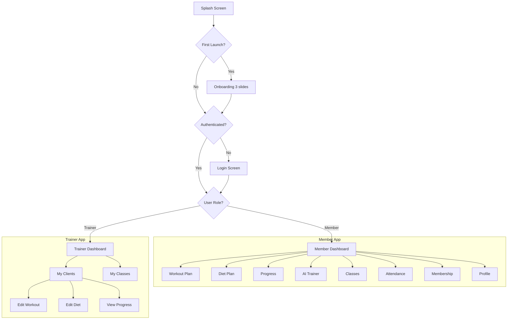

# Mobile App Screens (FlutterFlow)

## App Flow Overview



---

## Screen Specifications

### 1. Splash Screen

**Purpose**: Brand introduction, auth check

**Layout**:
```
┌─────────────────────────────────────┐
│                                     │
│                                     │
│                                     │
│           🏋️ GYMNAME               │
│          (Animated Logo)            │
│                                     │
│        ════════════════             │
│        (Loading indicator)          │
│                                     │
│                                     │
└─────────────────────────────────────┘
```

**Specs**:
- Background: Off-white `#FAF7F0`
- Logo: Gold gradient icon + text
- Loading: Gold line animation
- Duration: 2 seconds
- Auto-navigate based on auth state

---

### 2. Onboarding Screens (3 slides)

**Slide 1: Welcome**
```
┌─────────────────────────────────────┐
│                                     │
│        [Illustration: Gym]          │
│                                     │
│      Welcome to Premium Fitness     │
│                                     │
│   Your complete fitness companion   │
│   with AI-powered guidance          │
│                                     │
│            ● ○ ○                    │
│                                     │
│         [ Get Started ]             │
│              Skip                   │
└─────────────────────────────────────┘
```

**Slide 2: Features**
- Workout tracking, diet plans, progress

**Slide 3: AI Trainer**
- 24/7 AI assistance

---

### 3. Login Screen

**Layout**:
```
┌─────────────────────────────────────┐
│                                     │
│           🏋️ GYMNAME               │
│                                     │
│         Welcome Back!               │
│    Sign in to continue              │
│                                     │
│  ┌─────────────────────────────┐   │
│  │ 🇮🇳 +91 │ Phone Number      │   │
│  └─────────────────────────────┘   │
│                                     │
│      [ Send OTP ]                   │
│                                     │
│  ─────────── or ───────────        │
│                                     │
│      [ G  Continue with Google ]   │
│                                     │
│   By continuing, you agree to our   │
│   Terms of Service & Privacy Policy │
└─────────────────────────────────────┘
```

**Components**:
- Phone input with country code
- Primary gold button
- Google sign-in button (outline)
- Terms link

**API Calls**:
- `firebase.auth().signInWithPhoneNumber()`
- `firebase.auth().signInWithPopup(GoogleAuthProvider)`

---

### 4. OTP Verification Screen

```
┌─────────────────────────────────────┐
│  ←                                  │
│                                     │
│        Verify Your Number           │
│  Enter the 6-digit code sent to     │
│         +91 98765 43210             │
│                                     │
│    ┌───┐ ┌───┐ ┌───┐ ┌───┐ ┌───┐ ┌───┐
│    │ 1 │ │ 2 │ │ 3 │ │ 4 │ │ _ │ │ _ │
│    └───┘ └───┘ └───┘ └───┘ └───┘ └───┘
│                                     │
│          [ Verify ]                 │
│                                     │
│   Didn't receive? Resend in 30s     │
└─────────────────────────────────────┘
```

---

### 5. Profile Setup (New Users)

```
┌─────────────────────────────────────┐
│  ←             Step 1/3             │
│                                     │
│       Complete Your Profile         │
│                                     │
│          [ + Add Photo ]            │
│              (Avatar)               │
│                                     │
│  Full Name                          │
│  ┌─────────────────────────────┐   │
│  │ John Doe                     │   │
│  └─────────────────────────────┘   │
│                                     │
│  Gender                             │
│  ( ) Male  ( ) Female  ( ) Other    │
│                                     │
│  Date of Birth                      │
│  ┌─────────────────────────────┐   │
│  │ 15 Jan 1990              📅  │   │
│  └─────────────────────────────┘   │
│                                     │
│           [ Continue ]              │
└─────────────────────────────────────┘
```

**Step 2**: Physical details (height, weight)
**Step 3**: Fitness goals selection

---

### 6. Member Home Dashboard

```
┌─────────────────────────────────────┐
│  Good Morning, John! 👋        🔔   │
│                                     │
│  ┌─────────────────────────────┐   │
│  │ Today's Workout              │   │
│  │ Push Day - Chest & Triceps   │   │
│  │ 6 exercises • 45 min    →    │   │
│  └─────────────────────────────┘   │
│                                     │
│  Quick Access                       │
│  ┌────────┐ ┌────────┐ ┌────────┐  │
│  │  🏋️   │ │  🥗   │ │  📊   │  │
│  │Workout │ │  Diet  │ │Progress│  │
│  └────────┘ └────────┘ └────────┘  │
│  ┌────────┐ ┌────────┐ ┌────────┐  │
│  │  🤖   │ │  📅   │ │  ✓    │  │
│  │AI Chat │ │Classes │ │Check-In│  │
│  └────────┘ └────────┘ └────────┘  │
│                                     │
│  Membership Status                  │
│  ┌─────────────────────────────┐   │
│  │ Gold Plan    Active  ●      │   │
│  │ Expires: 15 days            │   │
│  └─────────────────────────────┘   │
│                                     │
│  📊 15 🔥 7                         │
│  Workouts  Day Streak               │
└─────────────────────────────────────┘
│  🏠    📋    📊    💬    👤        │
└─────────────────────────────────────┘
```

**Data Requirements**:
- Current workout plan (today's session)
- Membership status & expiry
- Attendance stats (workouts, streak)
- Unread notifications count

---

### 7. Workout Plan Screen

```
┌─────────────────────────────────────┐
│  ←  My Workout Plan                 │
│                                     │
│  Week 3 of 12                       │
│  ═══════════════════════════════    │
│                                     │
│  ┌─────────────────────────────┐   │
│  │ Day 1 - Push Day       ✓    │   │
│  │ Chest, Shoulders, Triceps   │   │
│  │ 6 exercises • 45 min        │   │
│  └─────────────────────────────┘   │
│                                     │
│  ┌─────────────────────────────┐   │
│  │ Day 2 - Pull Day       ●    │   │
│  │ Back, Biceps               │   │
│  │ 5 exercises • 40 min        │   │
│  └─────────────────────────────┘   │
│                                     │
│  ┌─────────────────────────────┐   │
│  │ Day 3 - Leg Day        ○    │   │
│  │ Quads, Hamstrings, Calves   │   │
│  │ 6 exercises • 50 min        │   │
│  └─────────────────────────────┘   │
│                                     │
│  ✓ Completed  ● Today  ○ Upcoming   │
└─────────────────────────────────────┘
```

---

### 8. Workout Detail Screen

```
┌─────────────────────────────────────┐
│  ←  Push Day                    ⋮   │
│      Chest, Shoulders, Triceps      │
│                                     │
│  ┌─────────────────────────────┐   │
│  │ 1. Barbell Bench Press       │   │
│  │    ┌────┐  4 sets × 10 reps  │   │
│  │    │ 📷 │  Rest: 90 sec      │   │
│  │    └────┘  Weight: 60 kg     │   │
│  │    [ Log Set ] [ ▶ Video ]   │   │
│  └─────────────────────────────┘   │
│                                     │
│  ┌─────────────────────────────┐   │
│  │ 2. Incline DB Press          │   │
│  │    3 sets × 12 reps          │   │
│  └─────────────────────────────┘   │
│                                     │
│  ┌─────────────────────────────┐   │
│  │ 3. Cable Flyes               │   │
│  │    3 sets × 15 reps          │   │
│  └─────────────────────────────┘   │
│                                     │
│      [ Start Workout ]              │
└─────────────────────────────────────┘
```

---

### 9. Diet Plan Screen

```
┌─────────────────────────────────────┐
│  ←  My Diet Plan                    │
│                                     │
│  Daily Target: 2400 cal             │
│  P: 180g  C: 240g  F: 80g          │
│                                     │
│  🌅 Breakfast (8:00 AM)             │
│  ┌─────────────────────────────┐   │
│  │ • Oatmeal with banana        │   │
│  │ • 4 Egg whites + 2 whole     │   │
│  │ • Greek yogurt               │   │
│  │ 550 cal | P:35g C:65g F:12g  │   │
│  └─────────────────────────────┘   │
│                                     │
│  🌞 Lunch (1:00 PM)                 │
│  ┌─────────────────────────────┐   │
│  │ • Grilled chicken breast     │   │
│  │ • Brown rice                 │   │
│  │ • Mixed vegetables           │   │
│  │ 650 cal | P:45g C:70g F:15g  │   │
│  └─────────────────────────────┘   │
│                                     │
│  [More meals...]                    │
└─────────────────────────────────────┘
```

---

### 10. Progress Tracking Screen

```
┌─────────────────────────────────────┐
│  ←  My Progress               + Add │
│                                     │
│  [ Weight ] [Measurements] [Photos] │
│                                     │
│      ┌─────────────────────────┐   │
│      │       Weight Chart       │   │
│      │    ╱╲    ╱╲              │   │
│      │   ╱  ╲  ╱  ╲  ╱         │   │
│      │  ╱    ╲╱    ╲╱          │   │
│      │ 75kg ──────── 72kg      │   │
│      │ Jan           Mar       │   │
│      └─────────────────────────┘   │
│                                     │
│  Current Stats                      │
│  ┌─────────┐ ┌─────────┐           │
│  │ Weight  │ │ Change  │           │
│  │  72 kg  │ │  -3 kg  │           │
│  └─────────┘ └─────────┘           │
│                                     │
│  Recent Entries                     │
│  • Mar 15 - 72 kg                   │
│  • Mar 8 - 73 kg                    │
│  • Mar 1 - 74 kg                    │
└─────────────────────────────────────┘
```

---

### 11. QR Check-In Screen

**Member View**:
```
┌─────────────────────────────────────┐
│  ←  Check In                        │
│                                     │
│       Show this QR at the gym       │
│                                     │
│      ┌─────────────────────────┐   │
│      │                         │   │
│      │      ▓▓▓▓▓▓▓▓▓▓        │   │
│      │      ▓▓▓▓▓▓▓▓▓▓        │   │
│      │      ▓▓▓▓▓▓▓▓▓▓        │   │
│      │      ▓▓▓▓▓▓▓▓▓▓        │   │
│      │      ▓▓▓▓▓▓▓▓▓▓        │   │
│      │       (QR Code)          │   │
│      └─────────────────────────┘   │
│                                     │
│           John Doe                  │
│        Member ID: GYM-12345         │
│                                     │
│        Today's Check-ins: 1         │
│        Last: 9:30 AM                │
│                                     │
└─────────────────────────────────────┘
```

---

### 12. Class Schedule Screen

```
┌─────────────────────────────────────┐
│  ←  Classes                   🔍    │
│                                     │
│  ◀ March 2024 ▶                     │
│  Su Mo Tu We Th Fr Sa               │
│           1  2  3  4                │
│   5  6  7 ●8  9 10 11               │
│  12 13 14 15 16 17 18               │
│                                     │
│  Friday, March 8                    │
│                                     │
│  ┌─────────────────────────────┐   │
│  │ 🧘 Power Yoga                │   │
│  │ 7:00 AM - 8:00 AM            │   │
│  │ Coach: Sarah  │ 15/20 spots  │   │
│  │              [ Book Now ]    │   │
│  └─────────────────────────────┘   │
│                                     │
│  ┌─────────────────────────────┐   │
│  │ 🏃 HIIT Circuit              │   │
│  │ 6:00 PM - 7:00 PM            │   │
│  │ Coach: Mike   │ FULL         │   │
│  │             [ Join Waitlist ] │   │
│  └─────────────────────────────┘   │
└─────────────────────────────────────┘
```

---

### 13. AI Trainer Chat

```
┌─────────────────────────────────────┐
│  ←  AI Trainer              Clear   │
│                                     │
│  ┌─────────────────────────────┐   │
│  │ 🤖  Hello John! I'm your AI  │   │
│  │    fitness assistant. How    │   │
│  │    can I help you today?     │   │
│  └─────────────────────────────┘   │
│                                     │
│         ┌─────────────────────┐    │
│         │ Can you suggest a    │    │
│         │ good post-workout    │    │
│         │ meal?               │    │
│         └─────────────────────┘    │
│                                     │
│  ┌─────────────────────────────┐   │
│  │ 🤖  Based on your goal of   │   │
│  │    muscle building, here's  │   │
│  │    a great post-workout:    │   │
│  │                             │   │
│  │    • Grilled chicken 150g   │   │
│  │    • White rice 1 cup       │   │
│  │    • Steamed broccoli       │   │
│  │                             │   │
│  │    This gives ~45g protein  │   │
│  │    and fast-digesting carbs │   │
│  └─────────────────────────────┘   │
│                                     │
│  ┌─────────────────────────────┐   │
│  │ Type your message...     📤  │   │
│  └─────────────────────────────┘   │
└─────────────────────────────────────┘
```

---

### 14. Profile Screen

```
┌─────────────────────────────────────┐
│             Profile            ⚙️   │
│                                     │
│           ┌────────┐               │
│           │  📷    │               │
│           │ Avatar │               │
│           └────────┘               │
│           John Doe                  │
│        john@email.com               │
│                                     │
│  ───────────────────────────────    │
│                                     │
│  My Details                    →    │
│  Fitness Goals                 →    │
│  Assigned Trainer              →    │
│  Notification Settings         →    │
│                                     │
│  ───────────────────────────────    │
│                                     │
│  Terms of Service              →    │
│  Privacy Policy                →    │
│  Help & Support                →    │
│                                     │
│  ───────────────────────────────    │
│                                     │
│        [ Log Out ]                  │
│                                     │
└─────────────────────────────────────┘
```

---

## Trainer-Specific Screens

### Trainer Dashboard

```
┌─────────────────────────────────────┐
│  Hello, Coach Sarah! 👋       🔔    │
│                                     │
│  Today's Schedule                   │
│  ┌─────────────────────────────┐   │
│  │ 🧘 Power Yoga    7:00 AM    │   │
│  │    15 attendees              │   │
│  ├─────────────────────────────┤   │
│  │ 🏋️ PT Session   10:00 AM   │   │
│  │    John D. - Strength        │   │
│  └─────────────────────────────┘   │
│                                     │
│  Quick Actions                      │
│  ┌────────┐ ┌────────┐            │
│  │  👥   │ │  📋   │            │
│  │Clients │ │Classes │            │
│  └────────┘ └────────┘            │
│                                     │
│  My Clients (12)                → │
│  ┌───┐ ┌───┐ ┌───┐ ┌───┐ ┌───┐   │
│  │JD │ │MK │ │AS │ │PL │ │+8 │   │
│  └───┘ └───┘ └───┘ └───┘ └───┘   │
│                                     │
└─────────────────────────────────────┘
```

### Client List

```
┌─────────────────────────────────────┐
│  ←  My Clients              🔍 + Add│
│                                     │
│  ┌─────────────────────────────┐   │
│  │ 👤 John Doe                  │   │
│  │    Muscle Building • Active  │ → │
│  │    Last session: 2 days ago  │   │
│  └─────────────────────────────┘   │
│                                     │
│  ┌─────────────────────────────┐   │
│  │ 👤 Mary Johnson              │   │
│  │    Weight Loss • Active     │ → │
│  │    Last session: Today       │   │
│  └─────────────────────────────┘   │
│                                     │
│  [More clients...]                  │
└─────────────────────────────────────┘
```

### Edit Workout Plan (Trainer)

```
┌─────────────────────────────────────┐
│  ←  Edit Workout: John Doe    Save  │
│                                     │
│  Plan Name                          │
│  ┌─────────────────────────────┐   │
│  │ 4-Day Push Pull Legs         │   │
│  └─────────────────────────────┘   │
│                                     │
│  Day 1 - Push Day              ⋮   │
│  ┌─────────────────────────────┐   │
│  │ 1. Bench Press  4×10     ✏️ │ │
│  │ 2. Incline DB   3×12     ✏️ │ │
│  │ 3. Cable Fly    3×15     ✏️ │ │
│  │         + Add Exercise       │   │
│  └─────────────────────────────┘   │
│                                     │
│  + Add Day                          │
│                                     │
│      [ Save Changes ]               │
└─────────────────────────────────────┘
```

---

## Navigation Structure

### Bottom Navigation (5 tabs)

**Member App**:
1. Home - Dashboard
2. Workout - Plans & logs
3. Progress - Tracking
4. AI - Chat assistant
5. Profile - Settings

**Trainer App**:
1. Home - Dashboard
2. Clients - Member list
3. Classes - Schedule
4. Progress - Member stats
5. Profile - Settings

---

## Next: [Cloud Functions →](./05-cloud-functions.md)
