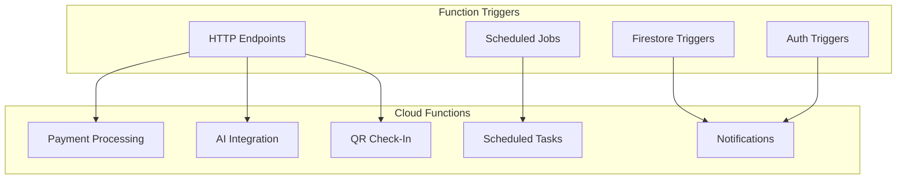

# Cloud Functions Specification

## Overview

Backend automation using Firebase Cloud Functions (Node.js/TypeScript).

---

## Function Categories



---

## 1. Membership Expiry Cron

**Trigger**: Scheduled (daily at 9:00 AM)
**Path**: `scheduledMembershipExpiryCheck`

```typescript
// Pseudo-code

export const scheduledMembershipExpiryCheck = functions.pubsub
  .schedule('0 9 * * *')  // 9 AM daily
  .timeZone('Asia/Kolkata')
  .onRun(async (context) => {
    
    const today = new Date();
    const remindDays = [7, 3, 1];
    
    for (const days of remindDays) {
      const targetDate = addDays(today, days);
      
      // Query memberships expiring on target date
      const expiring = await db.collection('memberships')
        .where('status', '==', 'active')
        .where('endDate', '==', targetDate)
        .get();
      
      for (const doc of expiring.docs) {
        const membership = doc.data();
        const user = await db.doc(`users/${membership.userId}`).get();
        
        // Send push notification
        await sendPushNotification({
          userId: membership.userId,
          title: 'Membership Expiring Soon',
          body: `Your membership expires in ${days} day(s). Renew now!`,
          type: 'membership',
          action: { type: 'navigate', destination: 'membership' }
        });
        
        // Send email
        await sendEmail({
          to: user.data().profile.email,
          template: 'membership-expiring',
          data: { days, userName: user.data().profile.firstName }
        });
        
        // Record reminder sent
        await doc.ref.update({
          renewalRemindersSent: admin.firestore.FieldValue.arrayUnion(days)
        });
      }
    }
    
    return null;
  });
```

---

## 2. Class Reminder Cron

**Trigger**: Scheduled (every hour)
**Path**: `scheduledClassReminder`

```typescript
export const scheduledClassReminder = functions.pubsub
  .schedule('0 * * * *')  // Every hour
  .timeZone('Asia/Kolkata')
  .onRun(async (context) => {
    
    const now = new Date();
    const oneHourLater = addHours(now, 1);
    
    // Find classes starting in ~1 hour
    const upcomingClasses = await db.collection('classes')
      .where('status', '==', 'scheduled')
      .where('dateTime', '>=', now)
      .where('dateTime', '<=', oneHourLater)
      .get();
    
    for (const classDoc of upcomingClasses.docs) {
      const classData = classDoc.data();
      
      // Get confirmed bookings
      const bookings = await db.collection('classBookings')
        .where('classId', '==', classDoc.id)
        .where('status', '==', 'confirmed')
        .where('reminderSent', '==', false)
        .get();
      
      for (const booking of bookings.docs) {
        await sendPushNotification({
          userId: booking.data().userId,
          title: 'Class Starting Soon!',
          body: `${classData.name} starts in 1 hour`,
          type: 'class'
        });
        
        await booking.ref.update({ reminderSent: true });
      }
    }
    
    return null;
  });
```

---

## 3. QR Check-In Validation

**Trigger**: HTTP Callable
**Path**: `validateQRCheckIn`

```typescript
export const validateQRCheckIn = functions.https.onCall(
  async (data, context) => {
    
    // Verify caller is admin/trainer
    if (!context.auth) {
      throw new functions.https.HttpsError('unauthenticated', 'Not authenticated');
    }
    
    const { qrData, branchId } = data;
    
    // Decode QR (contains userId)
    const userId = decodeQR(qrData);
    
    // Fetch user
    const userDoc = await db.doc(`users/${userId}`).get();
    if (!userDoc.exists) {
      return { success: false, error: 'USER_NOT_FOUND' };
    }
    
    // Check active membership
    const membership = await db.collection('memberships')
      .where('userId', '==', userId)
      .where('status', '==', 'active')
      .where('endDate', '>=', new Date())
      .limit(1)
      .get();
    
    if (membership.empty) {
      return { 
        success: false, 
        error: 'NO_ACTIVE_MEMBERSHIP',
        user: userDoc.data().profile
      };
    }
    
    // Check for duplicate check-in today
    const today = format(new Date(), 'yyyy-MM-dd');
    const existingCheckIn = await db.collection('attendance')
      .where('userId', '==', userId)
      .where('branchId', '==', branchId)
      .where('date', '==', today)
      .limit(1)
      .get();
    
    if (!existingCheckIn.empty) {
      return {
        success: true,
        alreadyCheckedIn: true,
        checkInTime: existingCheckIn.docs[0].data().checkInTime
      };
    }
    
    // Log attendance
    const attendanceRef = await db.collection('attendance').add({
      userId,
      branchId,
      gymId: userDoc.data().gymId,
      date: today,
      checkInTime: admin.firestore.FieldValue.serverTimestamp(),
      method: 'qr_code'
    });
    
    // Update user stats
    await db.doc(`users/${userId}`).update({
      'stats.lastCheckIn': admin.firestore.FieldValue.serverTimestamp(),
      'stats.totalWorkouts': admin.firestore.FieldValue.increment(1)
    });
    
    // Send confirmation notification
    await sendPushNotification({
      userId,
      title: 'Check-In Successful! ✓',
      body: 'Have a great workout!',
      type: 'general'
    });
    
    return {
      success: true,
      user: userDoc.data().profile,
      attendanceId: attendanceRef.id
    };
  }
);
```

---

## 4. Razorpay Payment Webhook

**Trigger**: HTTP Endpoint
**Path**: `razorpayWebhook`

```typescript
export const razorpayWebhook = functions.https.onRequest(
  async (req, res) => {
    
    // Verify webhook signature
    const signature = req.headers['x-razorpay-signature'] as string;
    const body = JSON.stringify(req.body);
    
    const expectedSignature = crypto
      .createHmac('sha256', config.razorpay.webhookSecret)
      .update(body)
      .digest('hex');
    
    if (signature !== expectedSignature) {
      console.error('Invalid webhook signature');
      res.status(400).send('Invalid signature');
      return;
    }
    
    const event = req.body;
    
    switch (event.event) {
      case 'payment.captured':
        await handlePaymentCaptured(event.payload.payment.entity);
        break;
      case 'payment.failed':
        await handlePaymentFailed(event.payload.payment.entity);
        break;
      case 'refund.processed':
        await handleRefundProcessed(event.payload.refund.entity);
        break;
    }
    
    res.status(200).send('OK');
  }
);

async function handlePaymentCaptured(payment: any) {
  const { order_id, id: paymentId, amount, notes } = payment;
  
  // Find pending payment
  const paymentQuery = await db.collection('payments')
    .where('razorpay.orderId', '==', order_id)
    .limit(1)
    .get();
  
  if (paymentQuery.empty) {
    console.error('Payment record not found:', order_id);
    return;
  }
  
  const paymentDoc = paymentQuery.docs[0];
  const paymentData = paymentDoc.data();
  
  // Update payment status
  await paymentDoc.ref.update({
    status: 'success',
    'razorpay.paymentId': paymentId,
    completedAt: admin.firestore.FieldValue.serverTimestamp()
  });
  
  // Activate/Renew membership
  if (paymentData.purpose === 'membership') {
    const planDoc = await db.doc(`membershipPlans/${paymentData.referenceId}`).get();
    const plan = planDoc.data();
    
    const startDate = new Date();
    const endDate = addDays(startDate, plan.durationDays);
    
    await db.collection('memberships').add({
      userId: paymentData.userId,
      branchId: paymentData.branchId,
      gymId: paymentData.gymId,
      planId: paymentData.referenceId,
      planSnapshot: {
        name: plan.name,
        durationDays: plan.durationDays,
        price: plan.price,
        features: plan.features
      },
      startDate,
      endDate,
      price: paymentData.amount,
      currency: paymentData.currency,
      finalPrice: paymentData.totalAmount,
      paymentId: paymentDoc.id,
      autoRenew: false,
      renewalRemindersSent: [],
      status: 'active',
      createdAt: admin.firestore.FieldValue.serverTimestamp(),
      createdBy: 'system'
    });
  }
  
  // Send confirmation
  await sendPushNotification({
    userId: paymentData.userId,
    title: 'Payment Successful! 🎉',
    body: `Your payment of ₹${amount/100} was successful.`,
    type: 'payment'
  });
}
```

---

## 5. AI Trainer Endpoint

**Trigger**: HTTP Callable
**Path**: `aiTrainerChat`

```typescript
export const aiTrainerChat = functions.https.onCall(
  async (data, context) => {
    
    if (!context.auth) {
      throw new functions.https.HttpsError('unauthenticated', 'Not authenticated');
    }
    
    const userId = context.auth.uid;
    const { message, conversationId } = data;
    
    // Fetch user context
    const userDoc = await db.doc(`users/${userId}`).get();
    const user = userDoc.data();
    
    // Fetch current workout plan
    const workoutQuery = await db.collection('workoutPlans')
      .where('userId', '==', userId)
      .where('status', '==', 'active')
      .limit(1)
      .get();
    
    const workoutPlan = workoutQuery.empty ? null : workoutQuery.docs[0].data();
    
    // Fetch recent progress
    const progressQuery = await db.collection('progressLogs')
      .where('userId', '==', userId)
      .orderBy('date', 'desc')
      .limit(5)
      .get();
    
    const progress = progressQuery.docs.map(d => d.data());
    
    // Build context prompt
    const systemPrompt = buildAIPrompt(user, workoutPlan, progress);
    
    // Call AI service
    const aiResponse = await callAIService({
      model: 'gpt-4o-mini',
      messages: [
        { role: 'system', content: systemPrompt },
        { role: 'user', content: message }
      ],
      temperature: 0.7,
      max_tokens: 500
    });
    
    // Store conversation
    const conversationRef = conversationId 
      ? db.doc(`aiConversations/${conversationId}`)
      : db.collection('aiConversations').doc();
    
    await conversationRef.set({
      userId,
      gymId: user.gymId,
      messages: admin.firestore.FieldValue.arrayUnion(
        { role: 'user', content: message, timestamp: new Date() },
        { role: 'assistant', content: aiResponse, timestamp: new Date() }
      ),
      updatedAt: admin.firestore.FieldValue.serverTimestamp()
    }, { merge: true });
    
    return {
      response: aiResponse,
      conversationId: conversationRef.id
    };
  }
);

function buildAIPrompt(user: any, workout: any, progress: any[]): string {
  return `You are a professional fitness trainer AI assistant.

USER PROFILE:
- Name: ${user.profile.firstName}
- Goal: ${user.goals?.primary || 'general fitness'}
- Experience: ${user.goals?.experienceLevel || 'beginner'}
- Current weight: ${user.physicalDetails?.currentWeight || 'unknown'} kg
- Target weight: ${user.goals?.targetWeight || 'not set'} kg

CURRENT WORKOUT PLAN:
${workout ? `${workout.name} - Week ${workout.currentWeek}` : 'No active plan'}

RECENT PROGRESS:
${progress.length > 0 
  ? progress.map(p => `${p.date}: ${p.measurements.weight}kg`).join('\n')
  : 'No progress data'
}

GUIDELINES:
- Give specific, actionable advice
- Consider user's experience level
- Avoid medical claims
- Keep responses concise
- Be encouraging and supportive`;
}
```

---

## 6. Create Payment Order

**Trigger**: HTTP Callable
**Path**: `createPaymentOrder`

```typescript
export const createPaymentOrder = functions.https.onCall(
  async (data, context) => {
    
    if (!context.auth) {
      throw new functions.https.HttpsError('unauthenticated', 'Not authenticated');
    }
    
    const { planId, branchId } = data;
    const userId = context.auth.uid;
    
    // Fetch plan details
    const planDoc = await db.doc(`membershipPlans/${planId}`).get();
    if (!planDoc.exists) {
      throw new functions.https.HttpsError('not-found', 'Plan not found');
    }
    
    const plan = planDoc.data();
    const amount = plan.price * 100; // Convert to paise
    
    // Create Razorpay order
    const order = await razorpay.orders.create({
      amount,
      currency: 'INR',
      receipt: `mem_${userId}_${Date.now()}`,
      notes: {
        userId,
        planId,
        branchId,
        purpose: 'membership'
      }
    });
    
    // Create payment record
    await db.collection('payments').add({
      userId,
      gymId: plan.gymId,
      branchId,
      amount: plan.price,
      currency: 'INR',
      method: 'razorpay',
      razorpay: { orderId: order.id },
      purpose: 'membership',
      referenceId: planId,
      description: `${plan.name} Membership`,
      subtotal: plan.price,
      totalAmount: plan.price,
      status: 'pending',
      createdAt: admin.firestore.FieldValue.serverTimestamp()
    });
    
    return {
      orderId: order.id,
      amount: order.amount,
      currency: order.currency,
      keyId: config.razorpay.keyId
    };
  }
);
```

---

## 7. Auth Triggers

```typescript
// On user creation
export const onUserCreated = functions.auth.user().onCreate(
  async (user) => {
    // Create user document
    await db.doc(`users/${user.uid}`).set({
      id: user.uid,
      profile: {
        phone: user.phoneNumber,
        email: user.email,
        displayName: user.displayName || ''
      },
      role: 'member',
      status: 'active',
      onboardingCompleted: false,
      createdAt: admin.firestore.FieldValue.serverTimestamp()
    });
  }
);

// On user deletion
export const onUserDeleted = functions.auth.user().onDelete(
  async (user) => {
    // Anonymize user data (GDPR compliance)
    await db.doc(`users/${user.uid}`).update({
      status: 'deleted',
      profile: {
        firstName: 'Deleted',
        lastName: 'User',
        email: null,
        phone: null
      }
    });
  }
);
```

---

## 8. Firestore Triggers

```typescript
// On new workout plan assigned
export const onWorkoutPlanCreated = functions.firestore
  .document('workoutPlans/{planId}')
  .onCreate(async (snap, context) => {
    const plan = snap.data();
    
    await sendPushNotification({
      userId: plan.userId,
      title: 'New Workout Plan! 💪',
      body: `"${plan.name}" has been assigned to you`,
      type: 'workout'
    });
  });

// On membership status change
export const onMembershipUpdated = functions.firestore
  .document('memberships/{membershipId}')
  .onUpdate(async (change, context) => {
    const before = change.before.data();
    const after = change.after.data();
    
    if (before.status !== 'active' && after.status === 'active') {
      await sendPushNotification({
        userId: after.userId,
        title: 'Membership Activated! 🎉',
        body: 'Your membership is now active. Time to workout!',
        type: 'membership'
      });
    }
  });
```

---

## API Endpoint Summary

| Function | Trigger | Authentication |
|----------|---------|----------------|
| `createPaymentOrder` | Callable | Required |
| `razorpayWebhook` | HTTP POST | Webhook signature |
| `validateQRCheckIn` | Callable | Admin/Trainer |
| `aiTrainerChat` | Callable | Required |
| `scheduledMembershipExpiryCheck` | Cron | N/A |
| `scheduledClassReminder` | Cron | N/A |
| `onUserCreated` | Auth | N/A |
| `onWorkoutPlanCreated` | Firestore | N/A |

---

## Next: [Admin Dashboard →](./06-admin-dashboard.md)
