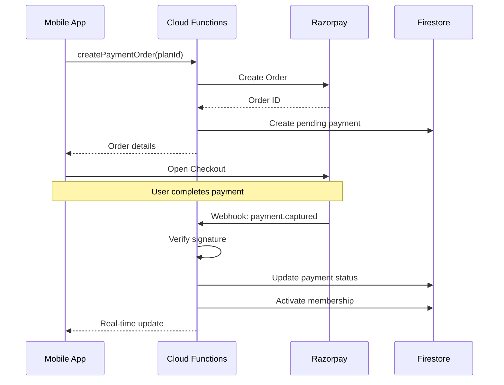

# API Contracts & Integration Plans

## API Overview

All APIs are implemented as Firebase Cloud Functions (Callable or HTTP).

---

## Authentication APIs

### 1. Verify Phone OTP
**Type**: Firebase Auth (built-in)

### 2. Get User Profile
**Type**: Firestore Direct Read
```typescript
GET /users/{userId}
Response: User object
```

---

## Payment APIs

### 1. Create Payment Order

**Type**: Callable Function

**Request**:
```typescript
{
  planId: string;
  branchId: string;
}
```

**Response**:
```typescript
{
  orderId: string;
  amount: number;      // In paise
  currency: string;    // "INR"
  keyId: string;       // Razorpay key
}
```

### 2. Razorpay Webhook

**Type**: HTTP POST

**Endpoint**: `/razorpayWebhook`

**Headers**:
```
X-Razorpay-Signature: <signature>
Content-Type: application/json
```

**Events Handled**:
- `payment.captured`
- `payment.failed`
- `refund.processed`

---

## QR Check-In APIs

### Validate QR Check-In

**Type**: Callable Function

**Request**:
```typescript
{
  qrData: string;      // Encoded user ID
  branchId: string;
}
```

**Response**:
```typescript
{
  success: boolean;
  error?: 'USER_NOT_FOUND' | 'NO_ACTIVE_MEMBERSHIP';
  alreadyCheckedIn?: boolean;
  checkInTime?: Timestamp;
  user?: {
    firstName: string;
    lastName: string;
    photoUrl?: string;
  };
  attendanceId?: string;
}
```

---

## AI Trainer APIs

### Chat with AI

**Type**: Callable Function

**Request**:
```typescript
{
  message: string;
  conversationId?: string;
}
```

**Response**:
```typescript
{
  response: string;
  conversationId: string;
}
```

---

## Razorpay Integration Plan

### Flow Diagram



### Implementation Steps

1. **Setup Razorpay Account**
   - Create account at razorpay.com
   - Get API Key ID and Secret
   - Configure webhook URL

2. **Store Credentials**
   ```bash
   firebase functions:config:set razorpay.key_id="rzp_xxx"
   firebase functions:config:set razorpay.key_secret="xxx"
   firebase functions:config:set razorpay.webhook_secret="xxx"
   ```

3. **Mobile Integration (FlutterFlow)**
   - Use Razorpay Flutter package
   - Custom action for payment flow

4. **Handle Offline Payments**
   - Admin can record cash/card payments
   - No Razorpay integration needed

---

## AI Trainer Integration

### Prompt Engineering

**System Prompt Template**:
```
You are a certified fitness trainer AI assistant for a premium gym.

USER CONTEXT:
- Name: {firstName}
- Primary Goal: {goal}
- Experience Level: {experienceLevel}
- Current Weight: {currentWeight} kg
- Target Weight: {targetWeight} kg

CURRENT PLAN:
{workoutPlanSummary}

RECENT PROGRESS:
{last5WeightEntries}

GUIDELINES:
1. Provide specific, actionable fitness advice
2. Consider the user's experience level
3. Be encouraging and supportive
4. Never give medical advice
5. Recommend consulting professionals for injuries
6. Keep responses concise (max 200 words)
7. Use bullet points for lists
8. Focus on {goal} in recommendations

LIMITATIONS:
- Do not prescribe supplements
- Do not diagnose conditions
- Do not recommend extreme diets
```

### API Configuration

```typescript
// GPT-4o-mini
const config = {
  model: 'gpt-4o-mini',
  temperature: 0.7,
  max_tokens: 500,
  presence_penalty: 0.1,
  frequency_penalty: 0.1
};

// OR Gemini 2.0 Flash
const config = {
  model: 'gemini-2.0-flash-exp',
  temperature: 0.7,
  maxOutputTokens: 500
};
```

---

## FCM Notifications

### Notification Events

| Event | Title | Body |
|-------|-------|------|
| Membership Expiring | Membership Expiring Soon | Expires in {days} days. Renew now! |
| Class Reminder | Class Starting Soon! | {className} starts in 1 hour |
| Class Booked | Booking Confirmed | You're booked for {className} |
| Workout Assigned | New Workout Plan | {planName} has been assigned |
| Payment Success | Payment Successful | ₹{amount} received |
| Check-in Success | Welcome! | Have a great workout! |
| Streak Update | 🔥 {count} Day Streak! | Keep up the momentum! |

### FCM Payload Structure

```typescript
{
  notification: {
    title: string;
    body: string;
    image?: string;
  },
  data: {
    type: 'membership' | 'class' | 'workout' | 'payment' | 'general';
    action: 'navigate' | 'open_url' | 'none';
    destination?: string;
    params?: string; // JSON stringified
  },
  token: string; // FCM device token
}
```

---

## Multi-Branch Architecture

### Data Isolation

```
Gym (FitZone)
├── Branch A (Koramangala)
│   ├── Members (branchId = A)
│   ├── Trainers (branchId = A)
│   ├── Classes (branchId = A)
│   └── Attendance (branchId = A)
│
├── Branch B (Indiranagar)
│   ├── Members (branchId = B)
│   └── ...
│
└── Shared Resources
    ├── Membership Plans (gymId)
    ├── Exercise Library (gymId)
    └── Workout Templates (gymId)
```

### Query Patterns

```typescript
// Get members for a branch
const members = await db.collection('users')
  .where('gymId', '==', gymId)
  .where('branchId', '==', branchId)
  .where('role', '==', 'member')
  .get();

// Get all members for a gym (super admin)
const allMembers = await db.collection('users')
  .where('gymId', '==', gymId)
  .where('role', '==', 'member')
  .get();
```

### Branch Transfer

```typescript
// Transfer member to another branch
await db.doc(`users/${userId}`).update({
  branchId: newBranchId,
  updatedAt: serverTimestamp()
});
```

---

## Security Rules Summary

### Key Rules

```javascript
// User can read own data
allow read: if request.auth.uid == resource.data.userId;

// Admin can read all branch data
allow read: if get(/users/$(request.auth.uid)).data.role == 'admin' 
            && get(/users/$(request.auth.uid)).data.branchId == resource.data.branchId;

// Super admin can read all gym data
allow read: if get(/users/$(request.auth.uid)).data.role == 'superadmin'
            && get(/users/$(request.auth.uid)).data.gymId == resource.data.gymId;
```

---

## Next: [Implementation Roadmap →](./08-implementation-roadmap.md)
